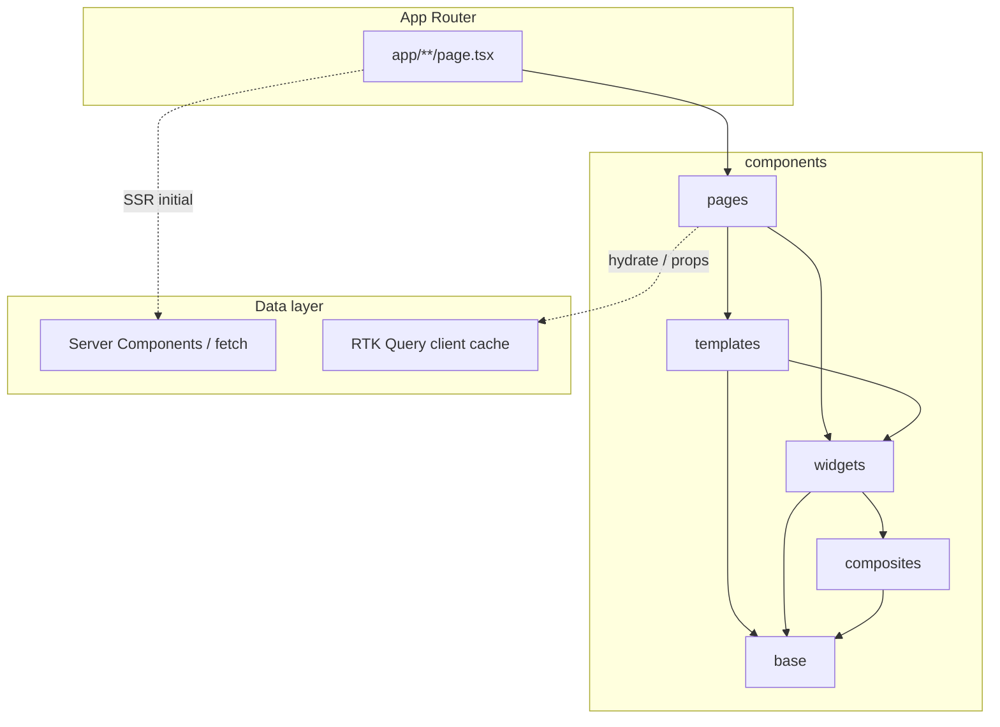

# Arquitetura

Foundation oficial do ecossistema frontend enterprise. **HeroUI** resolve primitives, tokens e acessibilidade; esta estrutura organiza **composição**, **ownership** e **boundaries** em escala SaaS.

## Visão enterprise

```txt
src/
  app/              → App Router (rotas finas, SSR, loading, API routes)
  components/       → UI em camadas (base → pages)
  config/           → config estática (nav, rotas públicas, app)
  hooks/            → hooks compartilhados (Redux, domínio)
  libs/             → utilitários internos
  providers/        → composição de contexto (store, theme, session)
  proxy.ts          → middleware / edge auth
  store/            → Redux + RTK Query (client cache, realtime prep)
  styles/           → tokens e globals
```

Objetivos: **consistência**, **ownership por domínio**, **onboarding previsível**, **codegen/IA alinhados** à mesma árvore de pastas.

## Camadas de UI

```txt
base
  ↓
composites
  ↓
widgets
  ↓
templates
  ↓
pages
```

| Camada         | Responsabilidade                                                    | Pode importar                   |
| -------------- | ------------------------------------------------------------------- | ------------------------------- |
| **base**       | Wrappers mínimos do HeroUI quando o design system exige padrão fixo | HeroUI, `@/lib`                 |
| **composites** | Peças reutilizáveis (fields, cards compostos)                       | base, HeroUI                    |
| **widgets**    | Blocos visuais completos (KPI, tabelas, toolbars)                   | composites, base, HeroUI        |
| **templates**  | Shell macro (sidebar, navbar, auth layout)                          | widgets de shell, base, config  |
| **pages**      | Composição final da tela                                            | templates, widgets, hooks leves |

## Fluxo de composição visual



## Regras de dependência

1. **Dependência unidirecional** — camadas superiores importam inferiores; nunca o inverso.
2. **Widgets** não importam `next/navigation`, rotas em `src/app`, nem pages.
3. **Pages** montam widgets + templates; **rotas** ficam em `src/app/**/page.tsx` (finas).
4. **Templates** estruturam layout; não concentram regras de negócio nem fetch pesado.
5. **base/** só quando HeroUI não cobre um padrão obrigatório do produto (ex.: `IconButton` com tooltip + `aria-label`).

## Ownership por domínio

```txt
widgets/
  shared/       → cross-domain (KPI row, charts genéricos)
  dashboard/    → home / overview
  orders/       → pedidos
  employees/    → RH / equipe
  analytics/    → métricas específicas (quando não couber em shared)
  auth/         → blocos de autenticação
```

Cada pasta de domínio é **owned** por um squad ou feature area. `shared/` exige revisão mais ampla (usado em 2+ domínios).

## App Router vs components

| Local                     | Papel                                 |
| ------------------------- | ------------------------------------- |
| `src/app/**/page.tsx`     | Rota, metadata, SSR, reexport da page |
| `src/components/pages/**` | Composição visual e wiring leve       |
| `src/app/api/**`          | BFF / Route Handlers                  |
| `src/proxy.ts`            | Auth gate, redirects, headers         |

## Estado e dados

| Ferramenta            | Uso oficial                                           |
| --------------------- | ----------------------------------------------------- |
| **Server Components** | First load, SEO, auth server-side, dados iniciais     |
| **RTK Query**         | Cache cliente, mutations, polling, SSE/WS (futuro)    |
| **Redux slices**      | Session, UI global mínima (não duplicar cache de API) |

Ver também: [server-client-strategy.md](./server-client-strategy.md), [rtk-query.md](./rtk-query.md), [realtime.md](./realtime.md), [export-strategy.md](./export-strategy.md).

## Documentação relacionada

- [conventions.md](./conventions.md) — naming, imports, barrels
- [widgets.md](./widgets.md) — widgets e `shared/`
- [pages.md](./pages.md) — pages e anti-patterns
- [templates.md](./templates.md) — app shell
- [redux-architecture.md](./redux-architecture.md) — store
- [middleware.md](./middleware.md) — proxy / auth edge
- [testing-strategy.md](./testing-strategy.md) — estratégia e diretrizes de testes
