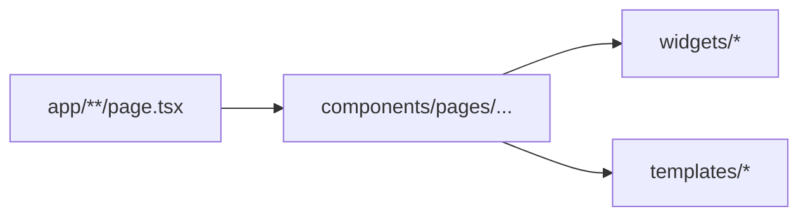

# Pages

Pages (`src/components/pages/`) são a **composição final** da experiência de uma rota. O App Router em `src/app/` permanece fino e delega para aqui.

## Responsabilidades

- Montar **widgets** e, quando necessário, **templates** locais.
- Layout de página: grid, gaps, `max-width`, ordem visual.
- Wiring **leve** de UI: tabs, filtros locais, estado de painel.
- Conectar hooks de formulário ou RTK Query **no nível da tela** quando não couber no widget.

## O que pages NÃO são

| Anti-pattern                     | Motivo                                                   |
| -------------------------------- | -------------------------------------------------------- |
| Business layer                   | Regras de negócio ficam em services, server actions, RTK |
| Fetch SSR pesado duplicado       | First load no Server Component / `app/page.tsx`          |
| Import de rotas em widgets       | Quebra boundary                                          |
| JSX gigante inline               | Extrair para `widgets/`                                  |
| `useRouter` para fluxo principal | Navegação estrutural no App Router / links               |

## Relação com templates

- **Template global** (`AppShell`, auth layout) → `src/app/(app)/layout.tsx` ou `auth/layout.tsx`.
- **Page** preenche o `children` do shell com widgets.
- Page **não** reimplementa sidebar/navbar — isso é template.

```txt
app/(app)/layout.tsx  →  AppShell (template)
app/(app)/page.tsx    →  <DashboardPage />   (page)
```

## Relação com widgets



A page **orquestra** widgets; widgets **não** importam pages.

## Server vs Client

- Preferir **Server Component** na page quando não há interatividade.
- Se um único filho precisa de client, extrair só esse filho para widget/client — evitar `'use client'` na page inteira por conveniência.

## Padrão App Router

```tsx
// src/app/(app)/orders/page.tsx
import { OrdersPage } from '@/pages/app/orders';

export default function Page() {
  return <OrdersPage />;
}
```

```tsx
// src/components/pages/app/orders/index.tsx
'use client'; // somente se necessário
import { OrdersRowActions } from '@/widgets/orders';

export function OrdersPage() {
  return <div className="mx-auto max-w-7xl ...">{/* widgets */}</div>;
}
```

## Dados

1. **Initial load** — Server Component em `app/` ou props serializadas.
2. **Pós-hydration** — RTK Query nos widgets/pages client.
3. **Não** duplicar o mesmo endpoint server + client sem `upsertQueryData` / `initialData`.

Ver [server-client-strategy.md](./server-client-strategy.md).

## Scaffold vs produção

`TODO` e mocks em `@/data/*` indicam substituição por `@/store/services/<domain>` mantendo a page como orquestradora visual.
