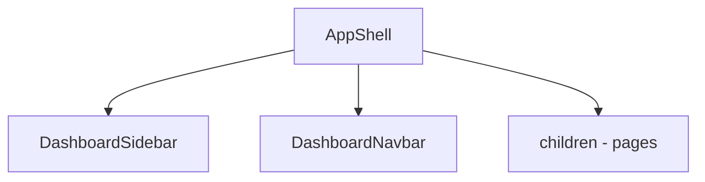

# Templates

Templates definem a **estrutura macro** da aplicação: app shell, sidebars, navbars e layouts compartilhados entre rotas.

## Localização

```txt
templates/
  app/     → área autenticada (AppShell, sidebar, navbar)
  auth/    → layout centralizado de autenticação
```

## Macro structure — App Shell



| Peça               | Arquivo                    | Papel                                                      |
| ------------------ | -------------------------- | ---------------------------------------------------------- |
| `AppShell`         | `templates/app/index.tsx`  | Integra `@heroui-pro/react` `AppLayout`, navegação, título |
| `DashboardSidebar` | `sidebar.tsx`              | Nav principal + footer items de `@/config/nav-items`       |
| `DashboardNavbar`  | `navbar.tsx`               | Título dinâmico, ações globais leves                       |
| `AuthTemplate`     | `templates/auth/index.tsx` | Centra conteúdo de login                                   |

## Layout orchestration

```tsx
// src/app/(app)/layout.tsx
import { AppShell } from '@/templates/app';

export default function AppLayout({ children }) {
  return <AppShell>{children}</AppShell>;
}
```

- **Uma** responsabilidade por layout group: `(app)`, `auth`, marketing futuro.
- `basePath` opcional no `AppShell` para preview/embed.

## Regras

| Permitido                                         | Evitar                                           |
| ------------------------------------------------- | ------------------------------------------------ |
| Widgets de **shell** (user menu futuro)           | Widgets de negócio (tabelas de pedidos)          |
| Config estática (`nav-items`)                     | Fetch de dados de domínio                        |
| `"use client"` no shell (sidebar/nav interativos) | Lógica de autorização pesada (usar proxy/server) |

## Boundaries

- Templates importam **base**, **config**, peças de navegação.
- Templates **não** importam `pages/`.
- Dados de usuário para navbar devem vir de **session provider** ou props do layout server (futuro), não de RTK Query pesado no template.

## Export

```ts
import { AppShell } from '@/templates/app';
import type { AppShellProps } from '@/templates/app';
```

Barrel em `templates/app/index.tsx` (ou `index.ts` reexportando o mesmo módulo).

## Auth layout

```tsx
// src/app/auth/layout.tsx
import { AuthTemplate } from '@/templates/auth';

export default function AuthLayout({ children }) {
  return <AuthTemplate>{children}</AuthTemplate>;
}
```
